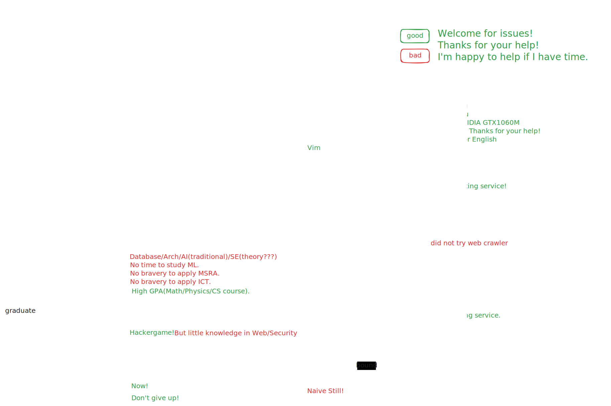

### Hi there 👋

I'm Lslightly. I have broad interests and I just seek time to start them or I have not found available resources to do them.

I am a CS graduate from USTC. After graduation, I got emo because I thought I didn't find my value. But actually it was there: trying new things and some practical tools.

- OS: Windows+WSL(without NVIDIA GPU), Ubuntu Server.
  - Not so good at command line and know a little bit.
- Programming Languages: Go, C++(<=11, moving to 14/17/20), Python >> Rust, Haskell, OCaml, SystemVerilog >> JS, TS, Java
- Known parts of CS(green hand): Compiler(traditional), Arch, Database, AI(<=2010, that is searching, constraint solvers and traditional ML methods), Formal Methods(few concepts)
- Unknown parts of CS: Web(Crawler, Browser, Frameworks), OS(know few concepts), Distributed System, Security(know few concepts), Reinforcement Learning, Software Engineering(know few concepts), MLSys(only CUDA Tutorial), Big Data Algorithm, Deep Learning, Graphics, Advanced Data Structures(No OI experience), Network(know few concepts), Verification(Coq, Lean, Type Theory)
- workflows: VSCode, Obsidian+Excalidraw+Git, Overleaf.
- keep improving: searching, evaluation, executing and English.

Beliefs:
- Believe Myself.
- Coding and Practice.
- Keep Improving like Vim.
- Offer Helps and Make Sense.
- Cooperation creates. Races have no winners.
- Seeking/Creating the Good in Life.




> contact with me through email. Thanks!

[](https://github.com/anuraghazra/github-readme-stats)

<!--START_SECTION:waka-->

```txt
Total Time: 59 hrs 45 mins

Markdown     28 hrs 55 mins  ████████████░░░░░░░░░░░░░   48.40 %
Go           17 hrs 46 mins  ███████▒░░░░░░░░░░░░░░░░░   29.74 %
TypeScript   4 hrs 18 mins   █▓░░░░░░░░░░░░░░░░░░░░░░░   07.21 %
JSON         3 hrs 41 mins   █▓░░░░░░░░░░░░░░░░░░░░░░░   06.18 %
Bash         1 hr 56 mins    ▓░░░░░░░░░░░░░░░░░░░░░░░░   03.25 %
Text         1 hr 40 mins    ▓░░░░░░░░░░░░░░░░░░░░░░░░   02.81 %
PowerShell   39 mins         ▒░░░░░░░░░░░░░░░░░░░░░░░░   01.09 %
```

<!--END_SECTION:waka-->

